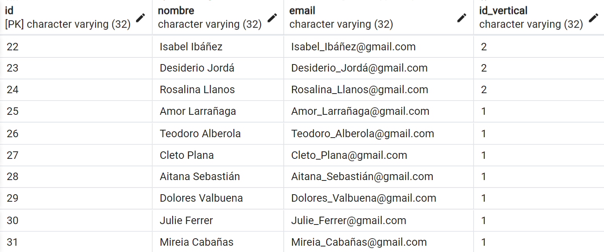

# Proyecto SQL #

Project made by [**Javier de Alcázar**](https://github.com/Alkaeee), [**Matías Ibarra**](https://github.com/Matias-Ibarra), [**Luis Ángel Soler**](), [**Raúl Awad**](https://github.com/raulwad13) y [**Gregorio Tremont**](https://github.com/GREGORIOtsr).

In this joint project, between The Bridge Data Science and FullStack students, a relational database was normalized and created from the data within the data folder.

-------------------------------------------------------------------------------

## Technologies used in this project: ##

- Python
- Pandas library
- Docker
- PostgreSQL
- pgAdmin
- Excalidraw
- ElephantSQL

-------------------------------------------------------------------------------

## Entity Relationship Model ##

-------------------------------------------------------------------------------

## Logical Model ##

-------------------------------------------------------------------------------

## Alumno Table Example ##

